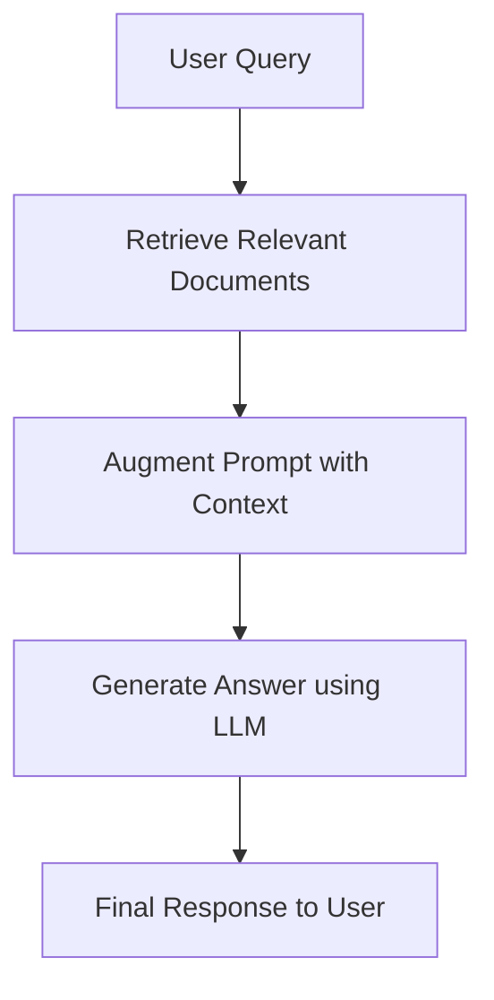

# GenAI-learning-journey
A repository documenting my daily learning journey with Generative AI and LangChain, featuring notes, examples, and hands-on experiments.

Setup Instructions

Follow the steps below to set up this project on your local machine:

### 1️⃣ Clone the Repository
1. Create a folder on your **Desktop** (e.g., `LangChain`).
2. Open a terminal and run:
   ```bash
   git clone https://github.com/MunawarShereen/GenAI-learning-journey.git
   cd GenAI-learning-journey

### 2️⃣ Set Up Virtual Environment
Create and activate a virtual environment:
py -m venv venv
venv\Scripts\activate

### 3️⃣ Install Dependencies
Install all the required Python packages:
pip install -r requirements.txt

### 4️⃣ Configure Environment Variables
Create a .env file in the root directory of the project.
Add the following line (replace "your_token_here" with your actual token):
HUGGINGFACE_API_TOKEN="your_token_here"

### 5️⃣ Setup Hugging Face
Create an account on Hugging Face.
Generate an Access Token from your profile settings.
Optionally, create or choose a model on Hugging Face.

### 6️⃣ Run the Project
Finally, run the Python script of your choice:
py fileName.py
Replace fileName.py with the actual script you want to execute.


# 🧠 LangChain Models – Notes

LangChain provides a powerful framework for working with models in AI applications.
Broadly, there are two main categories of models in LangChain:

## 1️⃣ Language Models (LMs)

Language models are designed to process and generate natural language.
They are further divided into two categories:

### 🔹 a) LLMs (Large Language Models – Legacy)

LLMs were the first generation of language models used in LangChain.
They are designed for general-purpose text generation, such as:

✅ Generating text

✅ Summarizing documents

✅ Answering questions

✅ Writing and explaining code

### 🔹 b) Chat Models (Modern)

Chat models are the preferred way to work with language models today.
Unlike traditional LLMs, ChatModels are designed for multi-turn conversations.
They:

✅ Accept structured input (e.g., system, user, and assistant messages)

✅ Maintain conversational context

✅ Support multi-turn interactions

📌 Closed-Source vs Open-Source Language Models
Language models can be closed-source or open-source:
| **Type**          | **Examples**                                      | **Notes**                                      |
| ----------------- | ------------------------------------------------- | ---------------------------------------------- |
| **Closed Source** | OpenAI (GPT), Claude (Anthropic), Gemini (Google) | Hosted via API, easy to use, highly capable    |
| **Open Source**   | Hugging Face models, LLaMA, Mistral               | Self-hostable, customizable, great for privacy |

### 2️⃣ Embedding Models

Embedding models convert text into numerical vectors that capture meaning.
These embeddings can be used for:

✅ Semantic Search (finding similar documents)

✅ Clustering & Classification

✅ Recommendation Systems

✅ Retrieval-Augmented Generation (RAG)


✅ Key Takeaways
Language Models → Generate and process text
🔹 LLMs → Old approach, general-purpose text generation
🔹 ChatModels → Modern approach, conversational & context-aware
Embedding Models → Convert text into vectors for semantic search and retrieval
Both categories have open-source and closed-source options.


# 🧠 LangChain Prompts – Notes

Prompts are the foundation of interaction with language models in LangChain. They define what input is sent to the model and strongly influence the quality of the response.

## 1️⃣ What are Prompts?

Prompts are structured instructions that guide a language model to produce useful and relevant outputs.

They can include:
✅ Direct instructions
✅ Variables (dynamic content)
✅ Examples (few-shot learning)
✅ Conversation context (for chat models)

2️⃣ Types of Prompts in LangChain

#### 🔹 a) String Prompts

Simple text inputs.

Directly send raw text to the model.

#### 🔹 b) Prompt Templates

Prompts with placeholders for variables.

Allow dynamic and reusable input structures.

#### 🔹 c) Few-Shot Prompts

Include examples of inputs and outputs.

Help the model generalize better by learning from patterns.

#### 🔹 d) Chat Prompts

### 3️⃣ Why are Prompts Important?

Prompts help you:
✅ Control tone, style, and depth of answers
✅ Improve accuracy of model responses
✅ Provide additional context or constraints
✅ Break down complex tasks into smaller, structured steps

Designed for chat-based models.

Use roles such as system, user, and assistant.

### 4️⃣ Best Practices for Prompting

Be specific and clear – vague prompts lead to vague results.

Use examples for better guidance.

Leverage system messages in chat prompts to set rules.

Chain prompts together for complex workflows.

Iteratively refine prompts to optimize results.


# 🧠 LangChain Chains – Notes

Chains in LangChain allow you to build pipelines where the output of one step becomes the input of the next. This enables the creation of complex workflows that go beyond a single prompt–response interaction.

### 1️⃣ Sequential Chain

Tasks are executed step by step.

The output of one step becomes the input for the next.

Example 1: Topic Summarization

User provides a topic → LLM generates a detailed explanation

That explanation is sent to another LLM → Extract 5 key points

Example 2: Research Workflow

Step 1: Search API collects documents

Step 2: Summarize each document

Step 3: Generate a combined report for the user

✅ Best for workflows where each task depends on the previous one.

### 2️⃣ Parallel Chain

Multiple tasks run simultaneously on the same input.

Outputs are then merged or combined.

Example 1: Notes + Quiz Generator

User provides a detailed text

Chain A → Generates study notes

Chain B → Generates a quiz

Final output merges notes + quiz into a single package

Example 2: Multi-Style Writing

Input: Blog topic → Run in parallel

Chain A → Generates a formal version

Chain B → Generates a casual version

### 3️⃣ Conditional Chain

Uses branching logic to choose different paths based on conditions.

Helpful when output depends on feedback, data, or rules.

📌 Example 1: Feedback Handling

If feedback is positive → Respond with “Thank you! Please rate us ⭐”

If feedback is negative → Generate a custom apology and troubleshooting message

📌 Example 2: Customer Support Bot

If query is about billing → Route to billing chain

If query is about technical issues → Route to tech-support chain

If query is general → Route to FAQ chain

✅ Best for decision trees, routing, and adaptive workflows.

Chain C → Generates a social media caption

✅ Best for generating multiple perspectives or outputs from one input.

# 🧠 LangChain Structured Output – Notes

Structured Output helps language models (LLMs) return well-organized data (like JSON) instead of plain text.  
This makes it easier to connect LLMs with other systems, such as databases or APIs.

---

## 1️⃣ What is Structured Output?

Structured Output means that the response from an LLM follows a specific structure or format (for example, JSON).  
Instead of generating free-form text, the LLM produces data that can be directly used in applications or tools.

---

## 2️⃣ Why do We Need Structured Output?

Language models usually generate **unstructured text**, which is hard for systems to understand or process automatically.  
Structured Output makes the data machine-readable, so it can be easily validated, stored, and used by other programs.

---

## 3️⃣ Common Use Cases

### 🔹 Use Case 1 – Resume Parsing
When a person uploads their resume (which contains their name, education, college, and work experience),  
the LLM can extract this information and create a **JSON file** like this:

```json
{
  "name": "John Doe",
  "education": "B.Tech in Computer Science",
  "college": "XYZ University",
  "work_experience": "3 years at ABC Company"
}
```
This structured format can then be used directly by HR systems, without any manual editing.

### 🔹 Use Case 2 – Product Reviews (e.g., Amazon)
Customer reviews are usually unstructured and vary in style.
Structured Output helps us extract useful details like product name, pros, and cons.

```json
{
  "product": "Mobile Phone",
  "pros": ["Good battery life", "Fast performance"],
  "cons": ["Camera quality could be better"]
}
```

### 🔹 Use Case 3 – Agents and Tools
LangChain Agents use different tools to perform tasks (for example, using a calculator for math).
Agents generate structured outputs that specify which tool to use and what inputs to give.

```json
{
  "action": "calculator",
  "input": "25 * 4"
}
```

The agent reads this structured output, sends it to the calculator tool, and returns the final result.

## 4️⃣ Why Structured Output is Important

Without structured data, it’s difficult to connect an LLM with other systems like databases, APIs, or external tools.
Structured Output acts as a bridge that allows communication between the LLM and other software components.

## 5️⃣ LLM Capabilities

There are two types of LLMs in this context:

Models that can generate structured outputs (for example, via JSON schemas).

Models that cannot generate structured outputs and only return plain text.

## 6️⃣ Working with Structured and Unstructured Outputs

For structured output, we use:
```python
llm.with_structured_output()
```
For unstructured output, we use:
```python
output_parsers
```
## 7️⃣ Pydantic – Data Validation

Pydantic
Pydantic is a Python library used for data type validation.
It ensures that the data returned by the LLM follows the correct types and structure which is very useful in APIs.

## 8️⃣ Making a Schema

Schemas define the structure of your output — what fields exist and what types of data they hold.

Here are three common ways to define schemas in LangChain:

---

### 🔹 1. TypedDict

A simple Python type hint that defines expected dictionary keys and their value types.  
Useful for lightweight and quick schema definitions.

**Example:**

```python
from typing import TypedDict

class ResumeSchema(TypedDict):
    name: str
    education: str
    college: str
    work_experience: str
```

---

### 🔹 2. Pydantic

A Python library for defining structured data with type validation and default values.
Useful when you want data integrity and built-in validation.

---

### 🔹 3. JSON Schema

A language-independent way to describe JSON data structures.
Use this when working across multiple languages or when you don’t need Python objects.

---

## 9️⃣ When to Use Which Schema

| Schema Type     | When to Use                                                           |
| ---------------- | -------------------------------------------------------------------- |
| **TypedDict**    | When you trust the LLM output and don’t need validation              |
| **Pydantic**     | When you want validation, default values, and strict type checking   |
| **JSON Schema**  | When working in multi-language environments or without Python objects |


## ✅ In Summary

Structured Output makes LLM responses predictable, validated, and machine-friendly.
It enables smooth integration between LLMs, APIs, and databases — forming the foundation of reliable AI applications.


# ⚙️ LangChain Runnables – Notes

## 🧠 What are Runnables?

**Runnables** are the fundamental **execution units** in LangChain.  
They define a **standardized interface** for running operations — taking an **input**, processing it, and producing an **output**.

In simple terms:

Every Runnable follows this pattern.

---

## 💡 Why Runnables Exist

Earlier, LangChain components (like LLMs, tools, chains, etc.) were **inconsistent** and **not standardized**, making it harder for new users to learn and combine different modules.

To solve this:
- LangChain introduced **Runnables** — a **unified interface** that all components follow.
- Now, components from different providers like **OpenAI**, **Google**, or **Anthropic** can interact seamlessly.
- This standardization makes building and connecting pipelines much easier.

---

## 🧩 Core Concept of Runnables

- Runnables are **units of work** that can run independently.  
- Each Runnable follows a **common interface**:
  - `invoke()` → runs the Runnable once.
  - `batch()` → runs the Runnable on multiple inputs.
- You can **connect** multiple Runnables together — the output of one becomes the input of the next.
- When you connect multiple Runnables, the entire chain also behaves as a **Runnable**, meaning you can keep extending it to form complex workflows.

---

## 🧱 Types of Runnables

Runnables are divided into two main categories:

### 1️⃣ Task-Specific Runnables
These are **core LangChain components** (like LLMs, retrievers, output parsers, etc.) that have been **converted into Runnables** so they can be easily used inside pipelines.  

They encapsulate specific functionality such as:
- Calling a language model
- Retrieving data from a database
- Parsing output into structured data

---

### 2️⃣ Runnable Primitives
Runnable primitives are **fundamental building blocks** that allow you to **structure execution logic** in AI workflows.  

They are used to combine, route, or transform data as it moves between components.

---

## 🧮 Runnable Primitives Explained

### 🔹 2.1 Runnable Sequence
- Executes multiple Runnables **in order**, one after another.
- The **output of one Runnable** becomes the **input to the next**.
- Used for creating **step-by-step workflows** (similar to a sequential chain).

**Example Use Case:**  
Pass user input → Generate summary → Extract keywords → Store results.

---

### 🔹 2.2 Runnable Parallel
- Executes multiple Runnables **at the same time (in parallel)**.  
- Useful when you want to perform **different tasks simultaneously** using the same input.

**Example Use Case:**  
From a single input text, generate:
- Notes summary  
- Quiz questions  
- Keywords extraction  

All done at once.

---

### 🔹 2.3 Runnable Passthrough
- Simply **returns the same output** as the input — acts as a “pass-through” node.
- Often used to **retain the original input** while performing other operations.

**Example Use Case:**  
If you send a topic to an LLM to “tell a joke,” and then use another Runnable to “explain the joke,”  
`RunnablePassthrough` ensures both the **joke** and its **explanation** are available as output.

---

### 🔹 2.4 Runnable Lambda
- Converts any **Python function** into a Runnable.  
- This allows you to integrate **custom logic** directly into LangChain pipelines.

**Example Use Case:**  
You can wrap a Python function (like text cleaning, formatting, or translation) as a Runnable  
and connect it with LLM Runnables in a workflow.

---

### 🔹 2.5 Runnable Branch
- Enables **conditional logic** in your pipelines.  
- Based on an input or condition, it can **route the flow** to different Runnables.

**Example Use Case:**  
If user feedback is **positive**, route to a “Thank You” message generator.  
If feedback is **negative**, route to a “Support” message generator.  

This allows for **dynamic decision-making** inside your pipeline.

---

## 🔗 Key Takeaways

| Concept | Description |
|----------|--------------|
| **Runnables** | Standardized execution units in LangChain |
| **Purpose** | To unify and simplify how components (LLMs, tools, retrievers) interact |
| **Interface** | Common methods like `invoke()` and `batch()` |
| **Composable** | You can chain or combine Runnables to build complex workflows |
| **Categories** | Task-Specific Runnables and Runnable Primitives |

---

## ✅ Summary

- Runnables bring **standardization** to LangChain’s architecture.  
- They allow seamless **interoperability** between tools, models, and logic.  
- You can connect Runnables sequentially or in parallel, apply conditions, or even wrap custom Python functions.  
- Every Runnable is reusable, composable, and can be integrated into **scalable GenAI pipelines**.


# 🧠 Output Parsers

Output Parsers in LangChain help **convert raw LLM responses into structured, machine-readable formats**.  
They ensure that the output from a Language Model is consistent, predictable, and ready to be used in applications or further processing.

In simple terms:  
> Output Parsers act as “format translators” that transform the often-messy text from an LLM into a clean and structured form (like JSON, strings, or Python objects).

---

## 💡 Why Output Parsers Exist

Language models usually return plain text — which can be inconsistent, unstructured, and hard to use in production pipelines.  
To make outputs usable and reliable, LangChain introduced **Output Parsers** as a standardized interface for parsing and validating responses.

This ensures:
- Consistency in LLM outputs  
- Better control over structure and format  
- Easier data extraction and integration with other systems  

With Output Parsers, you can easily define how you want your LLM to respond — whether it’s plain text, JSON, or even a fully validated schema using Pydantic.

---

## 🧩 Core Concept of Output Parsers

Output Parsers take **raw LLM text output** → apply a **parsing rule or schema** → return a **structured result**.

Each Output Parser follows a common idea:
- **Parse** → Convert LLM text into a specific format.  
- **Format Instructions** → Tell the LLM how to structure its response before generation.  
- **Validation (optional)** → Ensure the output matches the expected schema.

---

## 🧱 Types of Output Parsers

LangChain provides several types of Output Parsers depending on the desired level of structure and validation.

---

### 1️⃣ String Output Parser (`StrOutputParser`)

**What it does:**  
Takes the LLM’s response and returns it **as a simple string** — without any additional formatting.

**When to use:**  
- When you just need plain text from an LLM.  
- Commonly used inside basic chains or pipelines.  

**Example Use Case:**  
Summarization, creative writing, or Q&A tasks where structure isn’t required.

**Pros:**  
- Simple and lightweight  
- No schema or validation needed  

**Cons:**  
- Cannot enforce structure or consistency in the output  

---

### 2️⃣ JSON Output Parser (`JsonOutputParser`)

**What it does:**  
Instructs the LLM to produce output **strictly in JSON format**.

**When to use:**  
- When you need structured JSON responses directly from the model.

**Example Use Case:**  
Extracting key-value pairs, structured responses, or API-ready data.

**Pros:**  
- Forces LLM to output valid JSON  
- Easy to integrate with other tools and data systems  

**Cons:**  
- Does **not validate** schema or template  
- If the LLM makes a small formatting mistake, parsing may fail  

---

### 3️⃣ Structured Output Parser (`StructuredOutputParser`)

**What it does:**  
Parses structured JSON data **based on predefined field schemas**.

**When to use:**  
- When you want to extract structured fields (like name, age, location) from LLM responses.  
- Useful when you want predictable field names and structure.

**Example Use Case:**  
Extracting structured entities, form responses, or standardized data records.

**Pros:**  
- Enforces a predefined structure in the output  
- Ensures field-level consistency  

**Cons:**  
- Does **not support data validation**  
- Cannot enforce data types or custom constraints  

---

### 4️⃣ Pydantic Output Parser (`PydanticOutputParser`)

**What it does:**  
A structured output parser that uses **Pydantic models** to enforce **schema validation** on the parsed LLM responses.

**When to use:**  
- When you need both structure **and** validation.  
- Ideal for production pipelines where data accuracy matters.

**Example Use Case:**  
Generating validated JSON data that conforms to a strict schema (like user profiles, transactions, or reports).

**Pros:**  
- Ensures output follows the exact schema  
- Performs type and value validation automatically  
- Great for integration in reliable, production-grade workflows  

**Cons:**  
- Slightly more complex setup than other parsers  

---

## 🔗 Key Takeaways

| Concept | Description |
|----------|-------------|
| **Output Parsers** | Convert raw LLM text into structured formats |
| **Purpose** | To make LLM outputs consistent, structured, and validated |
| **Common Interface** | Parse methods and format instructions |
| **String Parser** | Returns plain text responses |
| **JSON Parser** | Forces LLM to output in JSON format |
| **Structured Parser** | Extracts data into a predefined JSON structure |
| **Pydantic Parser** | Uses schema validation for robust, error-free output |

---

## ✅ Summary

Output Parsers bring **structure and reliability** to LLM workflows.  
They make it possible to seamlessly convert unpredictable text responses into well-defined, machine-readable formats.

By choosing the right parser — whether **string**, **JSON**, **structured**, or **Pydantic** —  
you can ensure your GenAI pipelines are **consistent, validated, and ready for real-world applications**.

Every Output Parser in LangChain is **reusable, composable, and essential** for building scalable, production-grade AI systems.


# 🧠 Retrieval-Augmented Generation (RAG)

## 📘 What is RAG?

**RAG (Retrieval-Augmented Generation)** is a method that combines **information retrieval** with **language generation**.

In simple terms:  
> When you ask a question, the model first **retrieves relevant documents** from a **knowledge base** and then uses those documents as **context** to generate an **accurate and grounded response**.

---

## 💡 Why Use RAG?

Traditional **Large Language Models (LLMs)** like GPT or BERT have limitations:

- They can’t access **recent or private data** after training.  
- They sometimes **hallucinate** (generate incorrect information).

### ✅ Benefits of RAG

- **Up-to-date Information** → Retrieves the latest data dynamically.  
- **Better Privacy** → Keeps private data local instead of sending it to external servers.  
- **No Document Size Limit** → Can handle large documents efficiently.  

---

## ⚙️ Core Components of RAG

RAG systems typically include the following main components:

1. **Document Loaders**  
2. **Text Splitters**  
3. **Vector Databases**  
4. **Retrievers**

---

## 🧾 Document Loaders

### 🔍 What Are Document Loaders?

**Document Loaders** are tools that load your source data — such as text files, PDFs, websites, or CSVs — and convert them into a format that RAG systems can understand.

A document generally contains:
- **Page Content**: The main text or information.
- **Metadata**: Details about where the text came from (e.g., file name, URL, author).

### 📦 Types of Document Loaders (LangChain)

All these loaders exist in the `langchain_community` module.

#### 1️⃣ TextLoader
Used to load plain text (`.txt`) files.

#### 2️⃣ PyPDFLoader
Used to load text-based PDFs and convert each page into a document.
- Works well for **text PDFs**, but **not for scanned PDFs**.
- For PDFs with tables or columns, use **PDFPlumberLoader**.
- For PDFs with images or scanned data, use **UnstructuredPDFLoader** or **AmazonTextractPDFLoader**.

#### 3️⃣ DirectoryLoader
Loads multiple documents from a folder all at once, making it easy to process large collections of files.

📘 You can read more here:  
[LangChain Document Loaders](https://python.langchain.com/docs/concepts/document_loaders/)

---

## 🧩 Why Not Just Fine-Tune?

**Fine-tuning** means retraining a model with new data, but it has several challenges:

| Issue | Description |
|:------|:-------------|
| 💰 Expensive | Requires a lot of computing power and data |
| 🧠 Complex | Needs strong machine learning expertise |
| 🔄 Static | Must be redone when new data arrives |

### 🎓 Analogy

| Concept | Example |
|:---------|:---------|
| **Pretraining** | A student learning general knowledge in university |
| **Fine-tuning** | The student getting company-specific training |
| **RAG** | The student looking up reference books when needed |

RAG allows the model to “look up” new information without needing retraining.

---

## 🧠 In-Context Learning vs RAG

### 🧩 In-Context Learning (ICL)
The model learns to answer questions based on **examples given within the same prompt**.

### ⚙️ RAG
RAG goes beyond that — it retrieves **additional relevant information** from external sources before answering the question.  
This ensures the output is **factual and up-to-date**.

---

## ⚙️ How RAG Works

RAG typically involves **four main stages**:

---

### 🏗️ Step 1: Indexing  
*(Creating an external knowledge base)*

1. **Document Ingestion** – Load your data from various formats (like PDFs, text files, or websites).  
2. **Text Chunking** – Split large documents into smaller, meaningful chunks for efficient processing.  
3. **Embedding Generation** – Convert each chunk into a numeric representation (called an embedding) that captures its meaning.  
4. **Vector Storage** – Store these embeddings in a **Vector Database** (like FAISS, Pinecone, or Chroma) along with their metadata.

---

### 🔍 Step 2: Retrieval

When a user asks a question:
1. The system converts the query into an embedding.  
2. It searches the vector database for **similar chunks of information**.  
3. The most relevant pieces of text are selected as **context** for answering the question.

---

### ✍️ Step 3: Augmentation

The retrieved information is added to the prompt that will be sent to the model.  
This process is called **Prompt Augmentation** — it enriches the model’s understanding with real, factual context.

---

### 💬 Step 4: Generation

The final prompt, which now includes both the user’s question and the retrieved context, is sent to the **Language Model (LLM)**.  
The model then generates an **accurate, context-aware, and grounded response**.

---

## 🧭 RAG Workflow Overview


